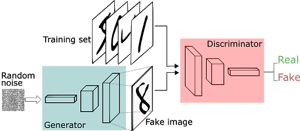
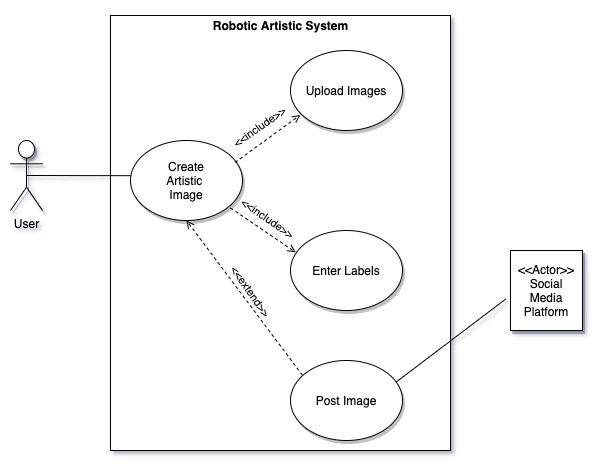
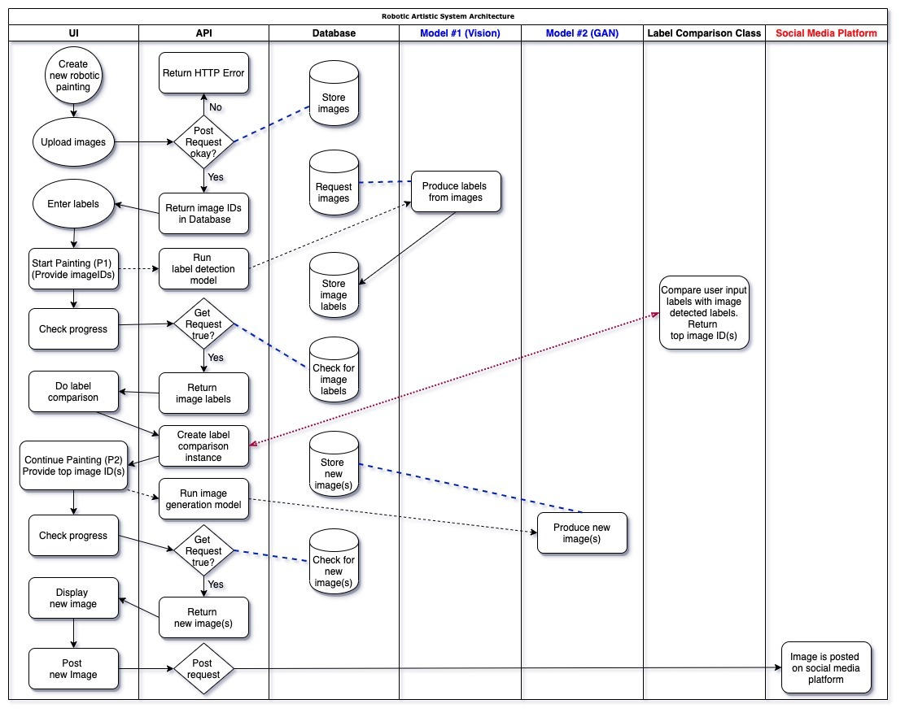

# Image Creation A.I.
## PyTorch Hackathon Summer 2020 Project

### Project Group Members:
- Santiago Norena
- Alejandro Martinez
- Hector Mejia
- Sahivy Gonzalez

### Type:
G.A.N. - Generative Adversarial Networks

### Technologies:
- Python
- PyTorch

### Submission Deadline:
5:00pm EDT Aug 25, 2020

### Project Architecture

#### Use Case Diagram

#### Cross-Function / Swim Lane Diagram

